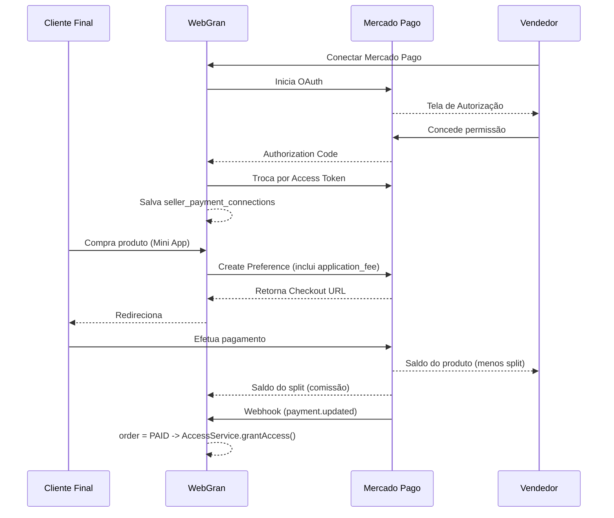
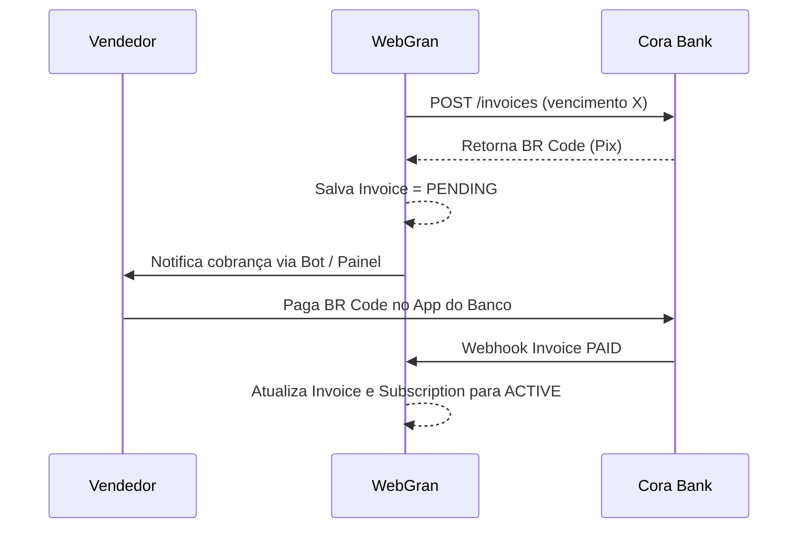

# Arquitetura de Pagamentos - WebGran

O WebGran lida com a complexidade de dois fluxos financeiros que jamais devem se misturar: o Marketplace (Clientes comprando dos Vendedores) e o Billing (Vendedores pagando o SaaS WebGran).

## Fluxo 1: Mercado Pago Marketplace (Split Payment)

Responsável pelas transações da "ponta". O cliente final não compra do WebGran, mas sim da loja do Vendedor. O Vendedor recebe o dinheiro diretamente em sua conta Mercado Pago e a comissão da plataforma (Application Fee) é separada de forma autônoma.

## Fluxo 2: Cora Bank (Platform Billing / Mensalidade)

Responsável pela saúde financeira da plataforma. O Vendedor paga uma mensalidade fixa para o WebGran poder manter sua loja e bots rodando.

## Diretórios e Abstrações

* `src/lib/payments/types`: Interfaces isoladas garantindo o Liskov Substitution Principle. Qualquer provedor pode assumir a vaga.
* `src/lib/payments/providers/mercado-pago.ts`: Implementação do Marketplace.
* `src/lib/payments/providers/cora.ts`: Implementação do Billing por PIX corporativo.

> **Regra de Ouro**: Tokens NUNCA transitam para o frontend. Não confie no webhook cegamente sem validar a assinatura do Headers. O ID de pagamento SEMPRE deve ser consultado individualmente na base do provider antes de processar qualquer entrega de produto ou plano.
