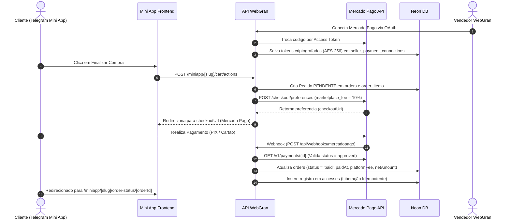

# WebGran — Arquitetura do Sistema de Recebimentos & Mercado Pago

## Visão Geral

O WebGran é uma plataforma SaaS multi-tenant onde vendedores gerenciam suas próprias lojas e vendem produtos digitais através de Mini Apps no Telegram. 
Cada vendedor conecta sua própria conta do **Mercado Pago** via OAuth para receber pagamentos diretamente em sua conta, enquanto o WebGran retém a taxa de plataforma (split automático de marketplace).

---

## Componentes do Sistema

1. **Provider de Mercado Pago (`src/lib/payments/providers/mercado-pago.ts`)**
   - Gera URL OAuth de autorização para vendedores (`connectSeller`).
   - Processa o código do callback OAuth e salva `accessToken` e `refreshToken` criptografados AES-256 (`handleOAuthCallback`).
   - Renova `accessToken` automaticamente caso esteja próximo da expiração (`getValidAccessToken`).
   - Cria preferências de checkout com `marketplace_fee` para split automático (`createCheckout`).
   - Processa webhooks do Mercado Pago e libera acessos do cliente de forma **idempotente** (`handleWebhook`).

2. **Serviço de Pagamentos (`src/lib/payments/payment-service.ts`)**
   - Singleton `paymentService` que expõe métodos simplificados para as rotas da aplicação.

3. **Endpoints de API (`src/app/api/payments/` & `src/app/api/webhooks/`)**
   - `GET /api/payments/mercadopago/connect`: Inicia o fluxo OAuth com o Mercado Pago.
   - `GET /api/payments/mercadopago/callback`: Recebe o callback com o código de autorização.
   - `POST /api/payments/mercadopago/disconnect`: Desconecta a conta do vendedor.
   - `POST /api/payments/checkout`: Gera uma preferência de checkout para uma compra direta.
   - `POST /api/webhooks/mercadopago`: Recebe notificações assíncronas de pagamentos do Mercado Pago.

4. **Painel do Vendedor (`src/app/(seller)/recebimentos/`)**
   - Apresenta card de conexão da conta Mercado Pago com status visual.
   - Exibe estatísticas financeiras: Saldo Líquido, Vendas Processadas (Bruto), Taxas da Plataforma e Contagem de Pedidos.
   - Tabela filtrável de transações com busca por ID e filtro de status (Pagos, Pendentes, Cancelados).

5. **Mini App Checkout & Confirmção (`src/app/miniapp/[slug]/`)**
   - Integração no carrinho (`src/app/miniapp/[slug]/cart/actions.ts`) para gerar preferência no MP e redirecionar o comprador.
   - Tela de confirmação e status do pedido (`src/app/miniapp/[slug]/order-status/[orderId]/page.tsx`).

---

## Variaveis de Ambiente Necessárias (`.env`)

```env
# Mercado Pago Credentials
MP_CLIENT_ID="seu_app_id_ou_client_id"
MP_CLIENT_SECRET="seu_client_secret"
MP_ACCESS_TOKEN="seu_access_token_da_plataforma"
MP_WEBHOOK_SECRET="seu_secret_de_webhook"

# Taxa de Plataforma WebGran (%)
NEXT_PUBLIC_PLATFORM_FEE_PERCENTAGE="10"
```

---

## Fluxo de Pagamento & Liberação de Acesso



---

## Segurança & Isolamento Multi-Tenant

- **Criptografia AES-256**: Nenhum `access_token` ou `refresh_token` é armazenado em texto puro. O módulo `src/lib/encryption.ts` criptografa todos os tokens antes de persistir no Neon DB.
- **Isolamento de Loja**: Todas as consultas verificam estritamente o `sellerId` da sessão autenticada ou o `storeId`.
- **Idempotência no Webhook**: O processamento de webhooks verifica a existência prévia de registros na tabela `accesses` por pedido/produto antes de conceder acesso, garantindo que notificações duplicadas do Mercado Pago não dupliquem acessos ou alterem estados já concluídos.
