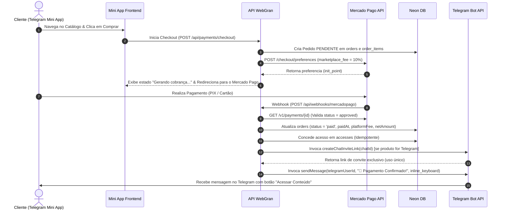

# WebGran — Arquitetura do Sistema de Recebimentos, Checkout & Entrega Automática via Telegram

## Visão Geral

O WebGran é uma plataforma SaaS multi-tenant onde vendedores gerenciam suas próprias lojas e vendem produtos digitais através de Mini Apps no Telegram. 
Cada vendedor conecta sua própria conta do **Mercado Pago** via OAuth para receber pagamentos diretamente em sua conta, enquanto o WebGran retém a taxa de plataforma (split automático de marketplace).

Após a aprovação do pagamento pelo Mercado Pago, o sistema processa o webhook de forma assíncrona, marca o pedido como pago, registra o acesso de forma **idempotente** e dispara automaticamente uma mensagem no Telegram do comprador com a entrega do produto (Link de convite de uso único para Grupo/Canal do Telegram via `createChatInviteLink` ou Link Externo).

---

## Componentes do Sistema

1. **Provider de Mercado Pago (`src/lib/payments/providers/mercado-pago.ts`)**
   - Gera URL OAuth de autorização para vendedores (`connectSeller`).
   - Processa o código do callback OAuth e salva `accessToken` e `refreshToken` criptografados AES-256 (`handleOAuthCallback`).
   - Renova `accessToken` automaticamente caso esteja próximo da expiração (`getValidAccessToken`).
   - Cria preferências de checkout com `marketplace_fee` para split automático (`createCheckout`).
   - Processa webhooks do Mercado Pago, atualiza pedidos, libera acessos idempotentes e realiza a entrega automática via Telegram (`handleWebhook`).

2. **Serviço de Pagamentos (`src/lib/payments/payment-service.ts`)**
   - Singleton `paymentService` que expõe métodos simplificados para as rotas da aplicação.

3. **Endpoints de API (`src/app/api/payments/`, `src/app/api/webhooks/` & `src/app/api/telegram/`)**
   - `GET /api/payments/mercadopago/connect`: Inicia o fluxo OAuth com o Mercado Pago.
   - `GET /api/payments/mercadopago/callback`: Recebe o callback com o código de autorização.
   - `POST /api/payments/disconnect`: Desconecta a conta do vendedor.
   - `POST /api/webhooks/mercadopago`: Recebe notificações assíncronas de pagamentos do Mercado Pago.
   - `POST /api/telegram/webhook`: Endpoint canônico do Telegram Webhook sem redirecionamento 308 (validado via `X-Telegram-Bot-Api-Secret-Token`).

4. **Painel do Vendedor (`src/app/(seller)/recebimentos/` & `src/app/(seller)/seller/products/`)**
   - Apresenta card de conexão da conta Mercado Pago com status visual.
   - Exibe estatísticas financeiras: Saldo Líquido, Vendas Processadas (Bruto), Taxas da Plataforma e Contagem de Pedidos.
   - Configuração de produtos com entrega por `telegram` (ID do Grupo/Canal Ex: `-100...`) ou `external` (Link externo de entrega).

5. **Mini App Checkout & Confirmação (`src/app/miniapp/[slug]/`)**
   - Navegação pelo catálogo do Mini App (`StudioHome`, `StudioCategory`).
   - Modal de Resumo de Pedido e Pagamento no Mini App.
   - Tela de confirmação e status do pedido (`/miniapp/[slug]/order-status/[orderId]`).

---

## Variáveis de Ambiente Necessárias (`.env`)

```env
# Mercado Pago Credentials
MP_CLIENT_ID="seu_app_id_ou_client_id"
MP_CLIENT_SECRET="seu_client_secret"
MP_ACCESS_TOKEN="seu_access_token_da_plataforma"
MP_WEBHOOK_SECRET="seu_secret_de_webhook"

# Public App URL (Usar sempre o domínio canônico com www)
NEXT_PUBLIC_APP_URL="https://www.webgran.online"

# Taxa de Plataforma WebGran (%)
NEXT_PUBLIC_PLATFORM_FEE_PERCENTAGE="10"
```

---

## Fluxo de Pagamento & Entrega Automática via Telegram



---

## Segurança & Isolamento Multi-Tenant

- **Criptografia AES-256**: Nenhum `access_token` ou `refresh_token` do Mercado Pago nem `tokenEncrypted` de bots do Telegram é armazenado em texto puro. O módulo `src/lib/encryption.ts` criptografa todos os tokens antes de persistir no Neon DB.
- **Validação de Webhook do Telegram (`secret_token`)**: O endpoint `/api/telegram/webhook` valida o cabeçalho `X-Telegram-Bot-Api-Secret-Token` contra o token gerado para a loja (`secret_token`), prevenindo forjamento de webhooks.
- **Evitar Redirect 308 no Telegram**: O Telegram recusa webhooks que respondam com HTTP 301, 302, 307 ou 308. O endpoint utiliza o domínio canônico `https://www.webgran.online/api/telegram/webhook` e `skipTrailingSlashRedirect: true` no `next.config.ts`.
- **Isolamento de Loja**: Todas as consultas verificam estritamente o `sellerId` da sessão autenticada ou o `storeId`.
- **Idempotência no Webhook**: O processamento de webhooks verifica a existência prévia de registros na tabela `accesses` por pedido/produto antes de conceder acesso ou reenviar notificações.
