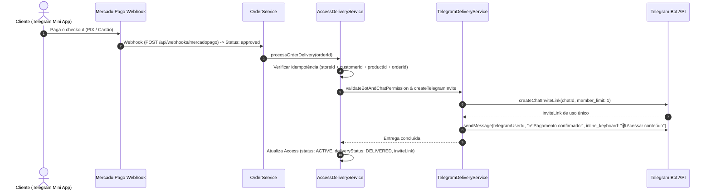

# WebGran — Documentação da Camada de Entrega Telegram & Gestão de Acessos (`Access`)

## Visão Geral

O WebGran possui uma camada isolada e desacoplada responsável pela entrega automática de produtos digitais via Telegram.
Diferente das abordagens simplistas que misturam pagamentos com envio de mensagens ou utilizam links fixos globais, o WebGran possui um serviço dedicado de entrega (`TelegramDeliveryService`) e orquestração (`AccessDeliveryService`), com persistência da entidade **`Access`** separada de **`Order`**, idempotência estrita, multi-tenancy e gerenciamento de retries no painel do vendedor.

---

## 1. Cadastro do Produto & Destino de Entrega

No painel do vendedor (`/seller/products`), ao criar ou editar um produto, o vendedor configura:
- **`deliveryType`**: `'telegram'` (Grupo / Canal Telegram) ou `'external'` (Link externo).
- **`deliveryValue`**: ID do Grupo/Canal do Telegram (Ex: `-1001234567890`) ou URL Externa.
- **`botId`**: Bot do Telegram vinculado ao produto/loja.

### Botão "Testar acesso":
Ao clicar em **"Testar acesso"** no modal do produto, o backend invoca `testTelegramChatAccessAction`, que chama `TelegramDeliveryService.validateBotAndChatPermission(botToken, telegramChatId)` usando o método `getChat` da Telegram Bot API. O resultado exibe:
- 🟢 **Bot conectado | Destino acessível (Nome do Grupo)**
- 🔴 **Bot sem permissão: Mensagem de erro**

---

## 2. Permissões do Bot no Telegram

Para a entrega automatizada em grupos ou canais do Telegram:
1. O Bot da loja **PRECISA** ser adicionado ao Grupo/Canal alvo.
2. O Bot **PRECISA** possuir permissões de **Administrador** com a permissão de convidar usuários via link (`can_invite_users`).

---

## 3. Fluxo de Compra, Pagamento & Webhook

---

## 4. Entidade `Access` & Idempotência

### Tabela `accesses` (Schema Neon DB):
- `id`: UUID (Primary Key)
- `storeId`: UUID (references `stores`)
- `customerId`: UUID (references `telegram_customers`)
- `productId`: UUID (references `products`)
- `orderId`: UUID (references `orders`)
- `deliveryType`: TEXT (`'telegram'` | `'external'`)
- `telegramChatId`: TEXT
- `inviteLink`: TEXT
- `status`: TEXT (`'PENDING'` | `'ACTIVE'` | `'REVOKED'` | `'EXPIRED'` | `'FAILED'`)
- `deliveryStatus`: TEXT (`'PENDING'` | `'DELIVERED'` | `'FAILED'`)
- `deliveryError`: TEXT
- `grantedAt`: TIMESTAMP
- `expiresAt`: TIMESTAMP

### Regra de Idempotência:
O `AccessDeliveryService` consulta previamente a existência de um registro em `accesses` para a tupla `(storeId, customerId, productId, orderId)`. Se o acesso já estiver com `status = 'ACTIVE'` e `deliveryStatus = 'DELIVERED'`, a execução é finalizada imediatamente sem gerar novos links ou disparar mensagens duplicadas no Telegram.

---

## 5. Falhas de Entrega & Mecanismo de Retry

Se o bot não tiver permissão no canal ou o envio falhar:
1. O pedido em `orders` permanece com status **`paid`** (o pagamento foi aprovado pelo Mercado Pago).
2. O registro em `accesses` é salvo com `status = 'FAILED'`, `deliveryStatus = 'FAILED'` e a causa do erro em `deliveryError`.
3. No painel do vendedor em `/seller/orders`, o pedido exibe o indicador 🔴 **FALHOU** com o motivo do erro e o botão **"Tentar novamente"**.
4. O botão **"Tentar novamente"** invoca `retryDeliveryAction`, executando somente a tentativa de entrega (`retryAccessDelivery`) sem duplicar cobranças, pedidos ou acessos.

---

## 6. Exibição no Mini App ("Meus Acessos")

No Mini App do Telegram (`/miniapp/[slug]/accesses`), o componente `StudioAccesses` lê todos os acessos com `status = 'ACTIVE'` do comprador. Cada produto possui o botão **"Acessar Conteúdo"**, abrindo diretamente o `inviteLink` gerado ou o link do produto.

---

## 7. Multi-Tenant & Segurança

- **Isolamento de Tenant**: As buscas por Bot (`telegramBots`) e produtos (`products`) filtram estritamente pelo `storeId`. O Bot A de uma loja A nunca pode ser acionado para entregar produtos da loja B.
- **Criptografia AES-256**: Todos os tokens de bots são criptografados no banco de dados e descritografados somente em memória durante o disparo via `decrypt(bot.tokenEncrypted)`.
